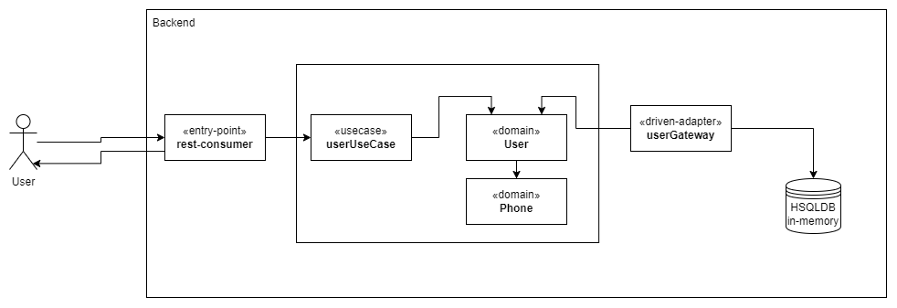

# Fish-classification
En el presente repositorio se creó el servicio backend del aplicativo pedido para InAdvance, el cual consiste en una aplicación en java que expone una API RestFul de creación de usuarios. 

Ejecución

Para la ejecución del proyecto solo es necesario abrirlo desde el IDE preferido (en este caso fue usado Intellij Idea), compilar las dependencias con maven y finalmente ejecutarlo. Se utilizó la versión de Java 17 para la realización del proyecto.

Introducción

El presente proyecto está construido en base a arquitectura limpia, siguiendo el patrón hexagonal y utilizando flujos reactivos para su construcción. En ese sentido, se tienen las siguientes carpetas:
- domain:  Consiste en toda la lógica de dominio de la aplicación con respecto al usuario (el cual contiene los teléfonos por dentro)
- database: Capa de la aplicación encargada de guardar la información en la base de datos (en este caso HSQLDB en memoria para su facilidad de uso) 
- entrypoints: Capa que se encarga de la obtención de la información de entrada (en este caso de tipo rest)
- commons: Clases helpers que ayudan a la realización de ciertos trabajos como el manejo de errores, jwt y logging.

Testeo manual

Dentro de la carpeta principal se encuentra la colleción de postman que fue usada para testear manualmente la aplicación y también servirá para que el evaluador la utilice ya que contiene todos los endpoints realizados para el proyecto. Para utilizarlo, se debe importar dentro de postman, escoger la request a probar y ejecutarla. 

Diagrama de la solución

